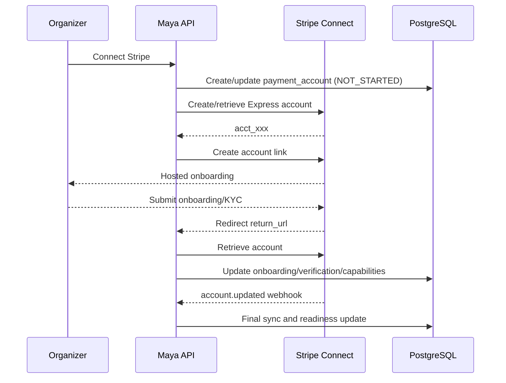
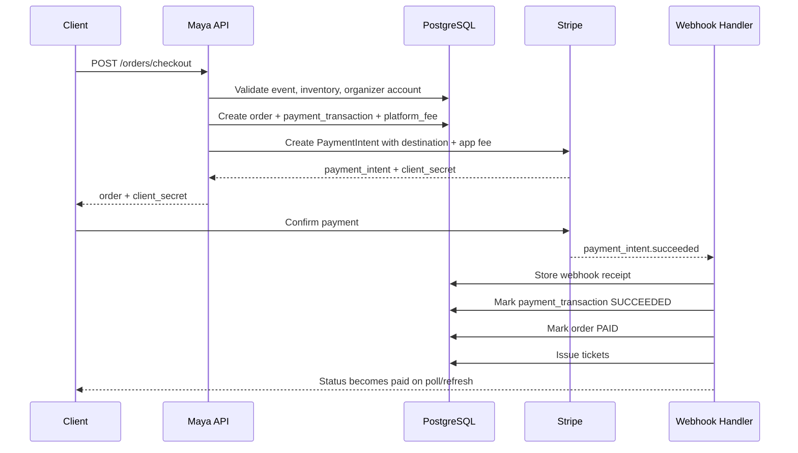
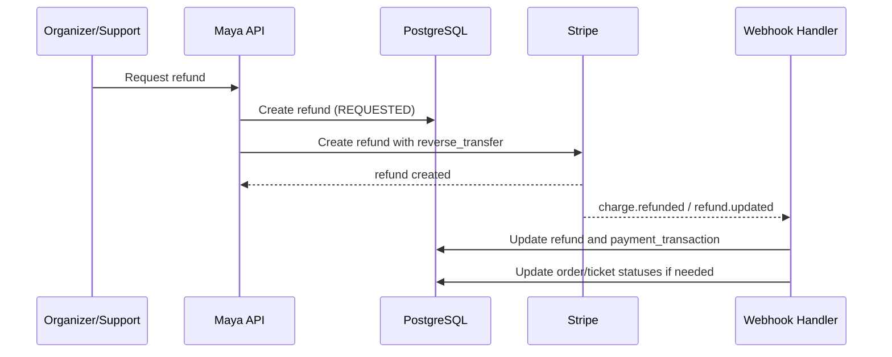
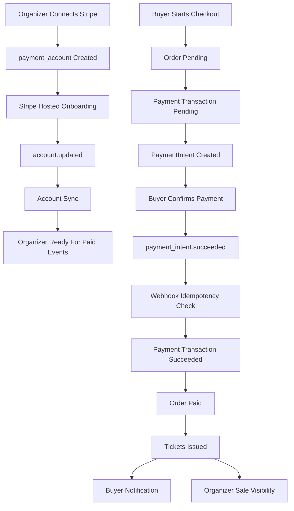

# Stripe Connect Marketplace Architecture for Maya

## 1. Executive Summary

Maya should evolve from a single-platform Stripe checkout into a Stripe Connect marketplace built on:

- `Stripe Connect Express` connected accounts for organizers
- `PaymentIntents` as the payment primitive
- `Destination charges` with `application_fee_amount`
- Webhook-driven payment finalization and account status synchronization
- Explicit payment-domain persistence for accounts, transactions, fees, refunds, disputes, and webhook processing

This model satisfies the core goals:

- Organizers receive proceeds into their own Stripe accounts
- Maya collects platform fees automatically during checkout
- Maya does not manually split, hold, or disburse organizer funds
- The design scales to thousands of organizers because onboarding, fee collection, payout scheduling, and compliance workflows stay inside Stripe

## 2. Recommended Stripe Model

### 2.1 Recommendation

Use `Stripe Connect Express` plus `destination charges`.

### 2.2 Why Express

Express is the best fit because Maya needs:

- Hosted onboarding for thousands of organizers
- Minimal compliance burden compared with Custom accounts
- More platform control and visibility than Standard accounts
- A Maya-branded operational experience without owning full KYC UX

### 2.3 Why Destination Charges

Use `PaymentIntent` creation on the Maya platform account with:

- `application_fee_amount`
- `transfer_data[destination] = connected_account_id`
- metadata linking the Stripe objects to `organizer`, `event`, `order`, and `payment_transaction`

This is the strongest fit for the current product because:

- Maya already owns a centralized checkout workflow
- Maya needs deterministic fee capture at payment time
- Maya must avoid a separate settlement engine
- Maya needs a consistent mobile and web payment orchestration path

### 2.4 Important Tradeoff

Destination charges make Maya closer to the merchant-of-record and dispute-control point for primary sales. That is acceptable for the current marketplace goal, but it means:

- disputes are operationally Maya’s responsibility to manage
- refunds should be coordinated by Maya
- reserve/risk planning matters more than in a direct-charge model

If the business later decides organizers must be the dispute-owning merchant of record, Maya can migrate future primary ticket sales to `direct charges` on Express accounts. That is a later commercial decision, not the best starting architecture.

## 3. Current-State Assessment

The current backend already has useful foundations:

- `orders` owns checkout creation
- `payments` owns Stripe and Paystack provider integrations
- ticket issuance happens only after payment confirmation
- `webhook_events` already stores processed webhook payloads
- a migration already introduces payment-domain tables such as `payment_accounts`, `payment_transactions`, `platform_fees`, and `refunds`

Important observation:

- the migration `prisma/migrations/20260522062601_add_payment_domain_foundation_day1/migration.sql` introduces payment-domain tables, but the active Prisma schema in `prisma/schema.prisma` does not appear fully aligned with that migration yet

That schema drift should be corrected before Connect implementation begins.

## 4. Target Architecture

### 4.1 Architectural Style

Follow clean architecture with clear separation:

- Domain: payment account, payment transaction, fee policy, refund, dispute, payout visibility
- Application services: onboarding, checkout orchestration, webhook processing, refund orchestration, account sync
- Infrastructure: Stripe SDK adapter, Prisma repositories, webhook signature verifier, background job runner
- Interface layer: organizer/admin APIs, checkout APIs, webhook endpoints

### 4.2 Bounded Responsibilities

- `Orders` remains responsible for basket validation, stock checks, and ticket issuance gating
- `Payments` becomes the source of truth for provider state and lifecycle events
- `Events` remains responsible for organizer ownership and publishability rules
- `Notifications` sends organizer and buyer status updates

### 4.3 Core Rule

Tickets are issued only after Maya records a `payment_transaction` as `SUCCEEDED` from a trusted provider event or verified reconciliation call.

## 5. Domain Model Changes

### 5.1 New or Formalized Aggregates

- `OrganizerPaymentProfile`
- `PaymentAccount`
- `PaymentTransaction`
- `PlatformFee`
- `Refund`
- `DisputeCase`
- `WebhookReceipt`

### 5.2 Organizer Payment Domain

`OrganizerPaymentProfile`

- one row per organizer
- stores default settlement preferences and payment readiness summary

`PaymentAccount`

- one row per organizer per provider
- for this phase, Stripe is primary and Paystack is ignored operationally
- stores the connected account id, onboarding status, capability flags, verification state, disabled reason, requirements snapshot, and audit metadata

### 5.3 Sales Payment Domain

`PaymentTransaction`

- one row per payment lifecycle for a purchase or refund-related financial transaction
- links to `order`, `event`, `organizer`, and provider references
- stores both commercial amounts and provider object identifiers

`PlatformFee`

- immutable record of fee policy applied to a payment
- supports fixed, percentage, and blended pricing
- supports future organizer-specific overrides

### 5.4 Dispute and Refund Domain

`Refund`

- one row per refund request or Stripe refund object
- supports partial and full refunds

`DisputeCase`

- one row per Stripe dispute
- links to the original `payment_transaction`
- tracks amount, reason, status, evidence deadlines, and final outcome

## 6. Database Schema Proposal

### 6.1 Organizer

Do not overload `users` with Stripe operational state. Keep user identity separate and relate payment state through dedicated tables.

Recommended updates:

- keep organizer identity in `users`
- add or retain `organizer_payment_profiles`
- add or retain `payment_accounts`

Recommended columns in `organizer_payment_profiles`:

- `organizer_id`
- `default_settlement_currency`
- `is_ready_for_paid_events`
- `readiness_checked_at`
- `first_ready_at`
- `pricing_plan_code`
- `pricing_plan_version`

Recommended columns in `payment_accounts`:

- `organizer_id`
- `provider`
- `external_account_id` for Stripe account id such as `acct_xxx`
- `account_type` such as `EXPRESS`
- `status`
- `verification_status`
- `onboarding_status`
- `charges_enabled`
- `payouts_enabled`
- `details_submitted`
- `currently_due_requirements`
- `eventually_due_requirements`
- `past_due_requirements`
- `disabled_reason`
- `country`
- `default_currency`
- `tos_acceptance_recorded_at`
- `onboarding_completed_at`
- `last_synced_at`
- `metadata`

### 6.2 Event

Add event-level payment readiness references so an event can be blocked from paid publication if the organizer is not Stripe-ready.

Recommended additions to `events`:

- `payment_provider` default `STRIPE`
- `payment_account_id` nullable reference to selected organizer payment account
- `payment_readiness_status`
- `platform_pricing_rule_id` nullable if event-level override is ever needed

Publishing rule:

- an event with paid ticket types cannot transition to `PUBLISHED` unless the organizer has a Stripe account with `charges_enabled = true` and onboarding state acceptable for live charging

### 6.3 Order / Ticket Purchase

The current `orders` table should continue to represent the commercial purchase intent, but no longer be the full payment record.

Recommended updates to `orders`:

- retain `status`, `subtotal_amount`, `fee_amount`, `total_amount`, `currency`
- keep `payment_provider`
- de-emphasize `payment_reference` as the main source of truth
- add `organizer_id`
- add `payment_transaction_id` nullable one-to-one or one-to-many anchor
- add `payment_state` if you want UI-friendly separation from order status
- add `payment_confirmed_at`
- add `checkout_expires_at`

Recommended order status semantics:

- `PENDING` means commercial order created, payment not final
- `PAID` means provider success confirmed and tickets can exist
- `FAILED` means payment definitively failed
- `CANCELLED` means user or session expired before success
- `REFUNDED` and `PARTIALLY_REFUNDED` remain outcome states

### 6.4 Payment

Use `payment_transactions` as the authoritative provider ledger entry.

Recommended columns:

- `organizer_id`
- `event_id`
- `order_id`
- `provider`
- `type`
- `status`
- `provider_reference`
- `provider_checkout_id` if a checkout session is still used on web
- `provider_payment_intent_id`
- `provider_charge_id`
- `provider_transfer_id`
- `provider_application_fee_id`
- `connected_account_id`
- `amount`
- `currency`
- `gross_amount`
- `platform_fee_amount`
- `organizer_net_amount`
- `settlement_state`
- `captured_at`
- `failed_at`
- `canceled_at`
- `failure_reason`
- `idempotency_key`
- `metadata`

### 6.5 Stripe Account Metadata

Use `payment_accounts.metadata` for low-value provider snapshots, but persist high-value fields as explicit columns.

High-value fields should be queryable without JSON extraction:

- `charges_enabled`
- `payouts_enabled`
- `verification_status`
- `disabled_reason`
- `last_synced_at`
- `onboarding_completed_at`

### 6.6 Platform Fee Tracking

`platform_fees` should be immutable and versioned by applied rule.

Recommended columns:

- `payment_transaction_id`
- `amount`
- `currency`
- `responsibility`
- `model`
- `percent_rate`
- `fixed_amount`
- `fixed_fee_application`
- `pricing_rule_id`
- `pricing_rule_snapshot`
- `metadata`

### 6.7 Refunds

Retain `refunds`, but expand it for Connect behavior:

- `provider_refund_id`
- `provider_reversal_id`
- `reverse_transfer`
- `refund_application_fee`
- `amount`
- `status`
- `reason`
- `requested_by_user_id`
- `requested_at`
- `processed_at`
- `failure_reason`

### 6.8 Disputes

Add a new `disputes` table.

Recommended columns:

- `payment_transaction_id`
- `provider`
- `provider_dispute_id`
- `provider_charge_id`
- `amount`
- `currency`
- `reason`
- `status`
- `evidence_due_by`
- `needs_response`
- `won_at`
- `lost_at`
- `closed_at`
- `metadata`

### 6.9 Webhook Events

The current `webhook_events` table is a good start. Expand it to support stronger operations.

Recommended additions:

- `source_account_id` for connected-account-aware events if needed later
- `signature_verified_at`
- `received_at`
- `event_created_at` from Stripe payload
- `processing_started_at`
- `processed_at`
- `next_retry_at`
- `dead_lettered_at`
- `delivery_attempts`
- `processing_error`

### 6.10 Suggested Indexes

- `payment_accounts(provider, external_account_id)` unique
- `payment_accounts(organizer_id, provider)` unique
- `payment_transactions(order_id)`
- `payment_transactions(provider, provider_payment_intent_id)` unique
- `payment_transactions(provider, provider_charge_id)` unique
- `payment_transactions(connected_account_id, created_at)`
- `platform_fees(payment_transaction_id)`
- `refunds(payment_transaction_id, created_at)`
- `disputes(payment_transaction_id)`
- `webhook_events(provider, provider_event_id)` unique
- `webhook_events(processed_at, next_retry_at)`

## 7. Schema Migration Plan

### 7.1 Migration Strategy

Use additive, backward-compatible migrations:

1. align `prisma/schema.prisma` with the existing payment-domain migration
2. add missing Connect-specific fields and `disputes`
3. backfill `organizer_id` and event links on payment rows
4. update application logic to dual-write old order fields and new payment tables
5. switch reads to the new payment domain
6. remove legacy payment assumptions later

### 7.2 Backfill Rules

- derive `organizer_id` from `events.organizer_id`
- map existing `orders.payment_reference` into `payment_transactions.provider_payment_intent_id` or `provider_reference` where possible
- mark historical rows with `metadata.migrated = true`

## 8. Organizer Onboarding Architecture

### 8.1 Supported Paths

Organizers can:

- create a new Express account through Maya
- connect an existing Stripe account through Maya by reusing or attaching the account if Stripe allows the same business identity and region configuration

Practical note:

- for Express, the usual Maya flow is still account creation plus hosted onboarding
- if an organizer already has a Stripe account, Maya should first attempt account lookup or relationship creation according to Stripe’s supported Connect flow for that region; if not possible, Maya should guide the organizer into a Stripe-hosted linking or re-onboarding path instead of pretending arbitrary account import is always available

### 8.2 Onboarding Flow

1. Organizer clicks `Connect Stripe`
2. Maya creates or resolves a `payment_account` record in `NOT_STARTED`
3. Maya creates a Stripe account if no connected account exists
4. Maya requests an `account_link`
5. Stripe hosts onboarding
6. Stripe redirects to Maya `return_url` or `refresh_url`
7. Maya syncs account state from Stripe and updates readiness

### 8.3 Refresh Flow

Use `refresh_url` to restart expired or abandoned onboarding.

Design rule:

- do not trust the browser redirect alone
- every return from Stripe triggers a server-side account retrieval from Stripe before updating readiness

### 8.4 Account Status Synchronization

Three sync mechanisms should coexist:

- synchronous sync when organizer returns from onboarding
- webhook sync on `account.updated`
- scheduled reconciliation job for stale or action-required accounts

### 8.5 Re-verification Handling

When Stripe changes requirements:

- `account.updated` updates `verification_status`, `currently_due_requirements`, `past_due_requirements`, and `disabled_reason`
- organizer sees `ACTION_REQUIRED`
- paid event publishing and new checkout attempts can be blocked depending on severity

Blocking rule:

- if `charges_enabled = false`, new paid orders must not be initiated
- if `payouts_enabled = false` but `charges_enabled = true`, Maya may still allow sales only if finance and support accept the operational risk; the safer default is to flag the organizer and optionally block publication until both are enabled

## 9. Fee Model Design

### 9.1 Supported Models

Support these fee models:

- percentage only
- fixed only
- blended fixed plus percentage
- organizer-specific contract override

### 9.2 Pricing Rule Model

Introduce a `pricing_rules` table or equivalent config source.

Recommended fields:

- `scope` such as `GLOBAL`, `ORGANIZER`, `EVENT`
- `organizer_id` nullable
- `currency`
- `percent_rate`
- `fixed_amount`
- `fixed_fee_application`
- `responsibility`
- `effective_from`
- `effective_to`
- `is_active`
- `version`

Resolution order:

1. organizer-specific active rule
2. event-specific override if introduced later
3. global default rule

### 9.3 Calculation Rule

At checkout, persist both:

- calculated amounts on `payment_transactions`
- immutable applied policy snapshot on `platform_fees`

That prevents retroactive fee changes from mutating historical sales.

## 10. Checkout and Payment Flow

### 10.1 Primary Purchase Flow

1. Client requests checkout quote or checkout creation
2. Backend validates event, ticket availability, and organizer payment readiness
3. Backend resolves organizer Stripe connected account
4. Backend resolves applicable pricing rule
5. Backend creates `order` in `PENDING`
6. Backend creates `payment_transaction` in `PENDING`
7. Backend creates Stripe `PaymentIntent` with:
   - `amount`
   - `currency`
   - `application_fee_amount`
   - `transfer_data.destination`
   - metadata
8. Backend stores Stripe ids and returns client secret plus order summary
9. Client confirms payment with Stripe SDK
10. Stripe sends webhook events
11. Maya verifies webhook authenticity and idempotency
12. Maya marks `payment_transaction` succeeded
13. Maya marks `order` paid
14. Maya issues tickets inside the same transactional finalization workflow

### 10.2 Why Webhooks Must Be Canonical

The client must never be the final source of truth for ticket issuance.

Allowed behavior:

- client can poll payment status
- client can show optimistic UI

Not allowed:

- issuing tickets based only on client-side success callbacks

## 11. Refund, Partial Refund, and Dispute Design

### 11.1 Refunds

Refund flow:

1. support or organizer requests refund through Maya
2. backend validates access and refundability
3. backend creates `refund` row in `REQUESTED`
4. Stripe refund is created against the original charge
5. set `reverse_transfer = true`
6. choose `refund_application_fee` according to Maya’s commercial policy
7. webhook or reconciliation updates refund status
8. order and ticket statuses update accordingly

Policy recommendation:

- full ticket refund: reverse organizer transfer and usually refund Maya fee only if Maya policy says so
- partial refund: reverse transfer proportionally and preserve explicit fee treatment in the refund record

### 11.2 Partial Refunds

Partial refunds must store:

- refunded gross amount
- refunded platform fee amount
- refunded organizer transfer amount

This is required for accurate revenue reporting and organizer visibility.

### 11.3 Chargebacks and Disputes

On `charge.dispute.created`:

- create or update `dispute` record
- flag the related payment transaction
- notify finance or support operations
- optionally freeze organizer dashboard payouts visibility for the affected sale until reviewed

Because this design uses destination charges, Maya should expect to own dispute operations and evidence submission workflows.

## 12. Webhook Architecture

### 12.1 Required Stripe Events

Handle at minimum:

- `payment_intent.succeeded`
- `payment_intent.payment_failed`
- `charge.refunded`
- `charge.dispute.created`
- `account.updated`

Recommended additional events:

- `payment_intent.canceled`
- `refund.updated`
- `charge.dispute.closed`
- `application_fee.refunded`

### 12.2 Verification

Every Stripe webhook request must:

- use raw body parsing
- verify `Stripe-Signature`
- reject on invalid signature
- reject stale timestamps according to Stripe tolerance window

### 12.3 Replay Protection

Replay protection should combine:

- Stripe signature timestamp tolerance
- unique `provider_event_id`
- immutable `webhook_events` receipt row

If the same event id arrives again after successful processing:

- return `200`
- do not re-run business logic

### 12.4 Idempotent Processing

Use two layers:

- inbound event idempotency via `webhook_events.provider_event_id`
- business-operation idempotency via natural uniqueness on `payment_transactions`, `refunds`, and ticket issuance checks

Example:

- if `payment_intent.succeeded` is processed twice, the second execution must observe that the transaction is already `SUCCEEDED` and tickets already exist, then exit safely

### 12.5 Retry Handling

Recommended handling:

- return non-2xx only for transient failures that should be retried by Stripe
- persist failed processing state with `processing_error`, `delivery_attempts`, and `next_retry_at`
- run an internal retry worker for recoverable business failures
- dead-letter permanently malformed or unsupported events

### 12.6 Account Sync from `account.updated`

For `account.updated`:

- fetch the latest Stripe account snapshot
- update `payment_accounts`
- update `organizer_payment_profiles.is_ready_for_paid_events`
- create an audit log entry
- notify organizer if action is required

## 13. API Contract Changes

### 13.1 Organizer Payment APIs

Add:

- `POST /api/organizers/me/payments/stripe/connect`
- `POST /api/organizers/me/payments/stripe/onboarding-link`
- `GET /api/organizers/me/payments/stripe/account`
- `POST /api/organizers/me/payments/stripe/refresh`
- `GET /api/organizers/me/payments/stripe/status`

Response fields should include:

- `connectedAccountId`
- `accountType`
- `onboardingStatus`
- `verificationStatus`
- `chargesEnabled`
- `payoutsEnabled`
- `requirements.currentlyDue`
- `requirements.pastDue`
- `disabledReason`
- `isReadyForPaidEvents`

### 13.2 Event APIs

Update event create or update responses to include:

- `paymentReadinessStatus`
- `canAcceptPayments`
- `connectedAccountSummary`

Add publish validation error contract:

- if organizer is not Stripe-ready, return a domain error such as `ORGANIZER_PAYMENT_ACCOUNT_NOT_READY`

### 13.3 Checkout APIs

Current checkout should evolve from checkout-session-first to payment-intent-first.

Recommended shape:

- `POST /api/orders/checkout`

Response:

- `orderId`
- `paymentTransactionId`
- `paymentProvider`
- `paymentIntentId`
- `clientSecret`
- `amount`
- `currency`
- `feeBreakdown`
- `paymentStatus`
- `expiresAt`

Optional:

- `nextActionRequired`
- `connectedOrganizerDisplayName`

### 13.4 Payment Status APIs

Add:

- `GET /api/orders/:id/payment-status`
- `GET /api/organizers/me/payments/transactions`
- `GET /api/organizers/me/payments/payouts`
- `GET /api/organizers/me/payments/disputes`

### 13.5 Refund APIs

Add:

- `POST /api/orders/:id/refunds`
- `GET /api/orders/:id/refunds`

Access rule:

- attendee can request according to policy
- organizer can request only for owned event orders and within permissions
- admin or support can override

## 14. Service Layer Changes

### 14.1 New Services

- `OrganizerStripeAccountService`
- `StripeAccountSyncService`
- `PaymentTransactionService`
- `PlatformFeeService`
- `StripeConnectCheckoutService`
- `RefundOrchestrationService`
- `DisputeSyncService`
- `WebhookProcessingService`

### 14.2 Existing Service Changes

`CheckoutService`

- validate organizer payment readiness before order creation
- create order plus payment transaction
- call `StripeConnectCheckoutService` instead of plain checkout session creation

`PaymentsService`

- split provider-specific concerns out of the current large service
- keep only orchestration or facade logic if needed

`PurchasedTicketIssuanceService`

- remain downstream of successful payment finalization
- consume `payment_transaction` rather than assuming order-only payment state

## 15. Repository Changes

Create focused repositories for repeated payment access patterns:

- `PaymentAccountRepository`
- `PaymentTransactionRepository`
- `RefundRepository`
- `WebhookEventRepository`
- `PricingRuleRepository`

Keep repository responsibilities narrow:

- persistence, uniqueness enforcement, standard read models
- no Stripe SDK calls

## 16. Event-Driven Workflow Design

### 16.1 Internal Domain Events

Emit internal application events such as:

- `organizer.payment_account.connected`
- `organizer.payment_account.requires_action`
- `payment.transaction.created`
- `payment.transaction.succeeded`
- `payment.transaction.failed`
- `payment.refund.succeeded`
- `payment.dispute.created`

### 16.2 Consumers

- ticket issuance consumer
- organizer notification consumer
- buyer notification consumer
- reporting and analytics consumer

This can be implemented initially with in-process event publication plus durable database state, then later moved to a queue if throughput demands it.

## 17. Sequence Diagrams

### 17.1 Organizer Onboarding

### 17.2 Ticket Purchase

### 17.3 Refund

## 18. Event Flow Diagram

## 19. Idempotency Strategy

### 19.1 Client-to-API

For checkout creation:

- require client-supplied idempotency key
- continue storing it on `orders`
- also persist it on `payment_transactions`

For refund creation:

- require admin or organizer request idempotency key for retry-safe support operations

### 19.2 API-to-Stripe

Use Stripe idempotency keys for:

- account creation
- account link creation where appropriate
- payment intent creation
- refund creation

Suggested key patterns:

- `organizer:{organizerId}:stripe-account:create:v1`
- `order:{orderId}:payment-intent:create:v1`
- `refund:{refundId}:stripe:create:v1`

### 19.3 Webhook Processing

Use `provider_event_id` uniqueness plus transactional updates to guarantee exactly-once business outcomes from at-least-once deliveries.

## 20. Retry Strategy

### 20.1 Synchronous Retry

Allowed for:

- transient Stripe API network errors during account or payment intent creation
- optimistic retry with bounded attempts and jitter

### 20.2 Asynchronous Retry

Use job-based retries for:

- failed webhook processing after receipt is persisted
- stale `ACTION_REQUIRED` account sync checks
- payment reconciliation for orders stuck in pending state

### 20.3 Reconciliation Jobs

Schedule jobs for:

- `pending` orders older than a short threshold
- `payment_transactions` without terminal state after webhook timeout
- `payment_accounts` in `ACTION_REQUIRED` or stale sync status

## 21. Security Design

### 21.1 PCI Scope

Keep Maya in low PCI scope by:

- using Stripe-hosted or Stripe SDK collection only
- never storing raw card numbers, CVC, or PAN-equivalent data
- storing only Stripe ids, statuses, and masked business metadata

### 21.2 Sensitive Data Handling

Store:

- connected account ids
- payment intent ids
- charge ids
- application fee ids

Do not store:

- uploaded identity documents from Stripe
- raw payment method details beyond Stripe-returned safe metadata

### 21.3 Fraud Prevention Opportunities

Use Stripe Radar plus Maya rules:

- velocity checks per user, event, device fingerprint, and IP
- block high-risk mismatches between organizer country, event country, and payment behavior
- reserve manual review for unusually high-value purchases or burst orders

### 21.4 Access Control

Organizer users should only see:

- their own payment account status
- their own event sales, refunds, disputes, and payout visibility

Support or admin users may see:

- cross-organizer payment operations
- webhook failures
- disputes queue

### 21.5 Audit Logging

Audit these actions:

- Stripe account connection attempts
- onboarding link generation
- account status transitions
- refund requests and approvals
- dispute state changes
- manual support overrides

## 22. Organizer Payout Visibility

Maya should show payout visibility, not payout control.

Recommended organizer-facing data:

- sale gross amount
- Maya fee
- organizer net amount
- Stripe payout enabled status
- settlement state
- expected payout timing
- refunded amount
- dispute hold or loss impact

Data source priority:

1. Stripe webhook-updated transaction state
2. reconciled Stripe API reads for stale rows
3. derived reporting rollups

## 23. Implementation Roadmap

### Phase 1: Domain Alignment

- align Prisma schema with existing payment migration
- add missing Connect-specific fields and `disputes`
- add repositories and DTOs for payment account and transaction reads

### Phase 2: Organizer Onboarding

- build Stripe Express account creation and onboarding link APIs
- persist and sync account readiness
- block paid-event publishing when readiness is insufficient

### Phase 3: Connect Checkout

- shift Stripe purchase flow from checkout-session-first to payment-intent-first
- create destination charges with application fees
- persist transaction and fee records

### Phase 4: Webhook Canonicalization

- expand webhook handling to payment intent, refund, dispute, and account events
- harden idempotency, retry, and dead-letter handling
- move ticket issuance exclusively behind succeeded transaction finalization

### Phase 5: Refunds and Disputes

- add refund APIs and transaction updates
- add dispute queue and organizer visibility

### Phase 6: Reporting and Reconciliation

- add payout visibility views
- add operational dashboards for failed webhooks, stale pending orders, and account-action-required cases

## 24. Risks and Mitigations

### 24.1 Platform Dispute Exposure

Risk:

- destination charges centralize dispute operations on Maya

Mitigation:

- explicit dispute workflow
- reserves planning
- organizer terms covering dispute responsibility

### 24.2 Schema Drift

Risk:

- payment migration and Prisma schema are already diverging

Mitigation:

- align schema before adding business logic
- add migration review checklist

### 24.3 Incomplete Onboarding

Risk:

- organizers may think they are connected while Stripe still requires action

Mitigation:

- readiness derived from Stripe capability flags, not UI redirects
- `account.updated` as canonical sync input

### 24.4 Duplicate Fulfillment

Risk:

- duplicate webhook deliveries could issue tickets twice

Mitigation:

- unique webhook event ids
- transactional payment finalization
- ticket issuance guardrails

### 24.5 Cross-Border and Currency Constraints

Risk:

- organizer country, settlement currency, and event currency combinations may not be universally supported

Mitigation:

- start with EUR-only Stripe Connect support
- validate account country and settlement capability before paid publication

## 25. Cost Considerations

Expect these cost components:

- Stripe payment processing fees
- Stripe Connect platform fees for Express accounts if applicable to your plan and region
- dispute fees
- refund cost impact, including whether Maya refunds its own application fee
- engineering cost for webhook operations, reconciliation jobs, and support tooling

Business recommendation:

- model refund policy explicitly because application-fee refund strategy affects Maya margin materially

## 26. Recommended Decisions for This Program

Adopt these as the default implementation decisions:

1. Use `Stripe Connect Express`
2. Use `destination charges` with `application_fee_amount`
3. Use `PaymentIntents` as the canonical payment object
4. Treat webhooks as the canonical trigger for payment finalization
5. Keep `orders` as commerce intent and `payment_transactions` as provider ledger
6. Block paid-event publication unless organizer Stripe account is ready
7. Add explicit `refunds` and `disputes` operational models
8. Start with `EUR` only for Connect-enabled events

## 27. Impacted Backend Areas

The primary backend areas that will be affected are:

- `src/orders/checkout.service.ts`
- `src/orders/order-payment.service.ts`
- `src/payments/payments.service.ts`
- `src/payments/payments.controller.ts`
- `prisma/schema.prisma`
- `prisma/migrations/`

## 28. Pre-Coding Checklist

Before implementation starts, confirm these decisions:

1. Maya accepts destination-charge dispute ownership for primary sales
2. Connect-enabled events are EUR-only in phase one
3. Paid event publication is blocked unless `charges_enabled` is true
4. Web and mobile will converge on PaymentIntent-based checkout
5. Refund policy defines when Maya’s application fee is returned

